# Diagnóstico e Plano Técnico: Sistema TechPulse

Este documento detalha o diagnóstico técnico do erro que impede a exibição de publicações no TechPulse e propõe o plano de implementação para transformar a rede social do jogo em um sistema vivo, complexo e responsivo às ações do jogador e dos concorrentes.

---

## 1. Diagnóstico do Problema Atual (Por que não aparecem publicações?)

### Arquivos e Classes Envolvidos
* **[GaragePrototypeBootstrap.cs](file:///d:/Unity/ModelFoundry/ModelFoundry/Assets/Editor/GaragePrototypeBootstrap.cs)**: Instancia a hierarquia da UI no editor e gera o Prefab de post.
* **[TechPulseUI.cs](file:///d:/Unity/ModelFoundry/ModelFoundry/Assets/Scripts/UI/TechPulseUI.cs)**: Gerencia o preenchimento dos campos do post e a exibição em tempo de execução.

### O Fluxo Atual de Criação e Exibição
1. `TechPulseFeed` gera posts e os insere na lista interna.
2. `TechPulseUI.Start` se inscreve no evento `OnNewPost` e instancia o prefab do post para os posts existentes.
3. A função `CreatePostUI(post)` clona o prefab `postPrefab` dentro do container de scroll (`scrollContent`).
4. Em seguida, busca os componentes `TextMeshProUGUI` usando `go.transform.Find("NomeDoFilho")`.

### O Ponto de Falha (Causa Raiz)
Na remodelação da interface (dentro do `GaragePrototypeBootstrap.cs`), para fins de design moderno, os campos de texto do post (como `AuthorName`, `AuthorHandle`, `Content` e `Stats`) foram aninhados dentro de um objeto filho chamado **`PostContainer`**:
```csharp
// Linha 1258 de GaragePrototypeBootstrap.cs
var postContainer = CreateUiRect("PostContainer", postPrefab.transform, ...);
...
// Linhas seguintes aninham os textos dentro do postContainer
var authNameRect = CreateTMPText("AuthorName", postContainer.transform, ...);
var authHandleRect = CreateTMPText("AuthorHandle", postContainer.transform, ...);
```
No entanto, no arquivo **`TechPulseUI.cs`**, o método `CreatePostUI` ainda realiza a busca direta sob a raiz do clone (`go`):
```csharp
// Linhas 162-171 de TechPulseUI.cs
var nameText = go.transform.Find("AuthorName")?.GetComponent<TextMeshProUGUI>();
var handleText = go.transform.Find("AuthorHandle")?.GetComponent<TextMeshProUGUI>();
var contentText = go.transform.Find("Content")?.GetComponent<TextMeshProUGUI>();
var statsText = go.transform.Find("Stats")?.GetComponent<TextMeshProUGUI>();
```
Como o método `transform.Find` do Unity **não realiza busca recursiva** (apenas busca filhos diretos), todos esses campos retornam `null`. Consequentemente:
- O texto e as cores dos posts não são aplicados.
- Os posts instanciados aparecem vazios/transparentes ou com textos estáticos do template ("Company Name", "Post content goes here"), quebrando a exibição correta do feed.

### Correção Mínima
Atualizar as strings de caminho no `transform.Find` de `TechPulseUI.cs` para refletir o novo aninhamento:
```csharp
var nameText = go.transform.Find("PostContainer/AuthorName")?.GetComponent<TextMeshProUGUI>();
var handleText = go.transform.Find("PostContainer/AuthorHandle")?.GetComponent<TextMeshProUGUI>();
var contentText = go.transform.Find("PostContainer/Content")?.GetComponent<TextMeshProUGUI>();
var statsText = go.transform.Find("PostContainer/Stats")?.GetComponent<TextMeshProUGUI>();
```

---

## 2. Plano de Implementação Modular: Rede Social Viva

Queremos que o TechPulse pareça um mercado de IA real, onde usuários comentam de forma autônoma, concorrentes se atacam, notícias corporativas acontecem, e a atividade do jogador dita o ritmo das interações.

### A. Fluxo de Reações de Lançamento
Ao lançar um produto (`RegisterProductLaunch`):
1. **Post do Jogador**: Publica o anúncio contendo o nome customizado do modelo e a frase de impacto proporcional à qualidade.
2. **Reações Baseadas no Mercado**:
   - O gerador de conteúdo calcula a qualidade média dos modelos concorrentes na mesma categoria.
   - O sistema gera de 3 a 8 posts/comentários de contas de usuários comuns.
   - **Qualidade Alta (Acima de 80% e melhor que concorrentes)**: Comentários positivos/entusiastas, comparações desfavoráveis para os rivais ("@{EmpresaJogador} destruiu o modelo da @NeuraCorp!").
   - **Qualidade Média (45% a 79%)**: Opiniões neutras, perguntas de desenvolvedores sobre limites de contexto ou suporte local.
   - **Qualidade Baixa (Abaixo de 45% ou pior que lançamentos anteriores)**: Críticas duras, memes, piadas sarcásticas, e usuários recomendando a concorrência.

### B. Sistema de Menções Orgânicas e Inatividade
1. **Opiniões Bobas e Menções Aleatórias**:
   - A cada 3-5 dias, gerar posts de usuários aleatórios marcando a empresa do jogador ("Estudando a documentação da @{EmpresaJogador}...", "A IA vai dominar o mundo e eu ainda apanhando no Git...", etc.).
2. **Cobrança de Inatividade**:
   - Se o jogador passar mais de 15 dias sem atividade (sem lançamentos, refinamentos ou campanhas), o feed começará a receber posts de cobrança ("Alguém na @{Empresa} ainda está acordado?", "Os rivais lançando novidades e a @{Empresa} sumida..."). Isso resultará em perda progressiva de seguidores e reputação.

### C. Posts e Notícias dos Adversários
1. **Lançamentos Rivais**: Adversários publicam sobre seus novos modelos com base em sua força (ex: NeuraCorp com posts corporativos agressivos, DeepForge com artigos científicos longos).
2. **Notícias de Bastidores (Não relacionadas a produtos)**:
   - Demissões ("Layoffs na @AtlasAI pegam mercado de surpresa...").
   - Financiamentos ("@DeepForge fecha rodada milionária com TitanCloud...").
   - Contratos ("@NexusSystems fecha parceria exclusiva para dados governamentais...").
   - Incidentes técnicos ("Oops, o RLHF da @NeuraCorp quebrou e o chatbot começou a falar em pirata... 🏴‍☠️").

### D. Mudanças de Seguidores (Mecânica Inicial)
- **Seguidores Iniciais**: O jogador inicia com exatamente **1 seguidor** (sua própria conta) e **1 seguindo** (um concorrente de nível baixo para servir de tutorial).
- **Crescimento**: Lançamentos excelentes geram crescimento acelerado de seguidores; lançamentos ruins causam perdas. A métrica `Following` também aumentará organicamente à medida que o laboratório do jogador descobre novas empresas ou faz alianças.

### E. Ações de Marketing e Refinamento
Integrar botões de ação social no HUD/Menu de contexto:
1. **Campanha de Marketing (Refinar Marca)**: Custa $2.500 faturados, concede +5% de reputação e +150 seguidores, e posta um anúncio oficial com engajamento automático.
2. **Campanha de Hype (Teaser do Modelo)**: Revela o desenvolvimento do próximo modelo, gerando posts de especulação dos usuários ("Dizem que o próximo modelo da @{Empresa} terá multimodalidade nativa! 👀").

---

## 3. Scripts a Serem Modificados ou Criados

```mermaid
graph TD
    classDef modified fill:#f96,stroke:#333,stroke-width:2px;
    classDef new fill:#9f9,stroke:#333,stroke-width:2px;

    TPFeed[TechPulseFeed.cs]:::modified
    TPUI[TechPulseUI.cs]:::modified
    PPController[PrototypeProjectController.cs]:::modified
    HUDC[HUDController.cs]:::modified
    
    TPGenerator[TechPulseContentGenerator.cs]:::modified
    TPFollowers[TechPulseFollowerSystem.cs]:::modified
    
    Bootstrap[GaragePrototypeBootstrap.cs]:::modified
```



### Scripts Existentes a Modificar:
1. **`TechPulseUI.cs`**:
   - Corrigir caminhos dos `transform.Find` para incluir o prefixo `"PostContainer/"`.
   - Garantir que seguidores/seguindo iniciais mostrem `1` e `1` (usar propriedades do `GameManager`).
2. **`TechPulseFeed.cs`**:
   - Integrar timers para geração de notícias corporativas dos concorrentes, menções aleatórias de usuários comuns e posts de inatividade do jogador.
3. **`TechPulseContentGenerator.cs`**:
   - Expandir substancialmente os bancos de frases (em português/inglês) com templates de reações complexas, incidentes corporativos dos concorrentes, menções bobas de tecnologia, e diálogos de hype.
4. **`TechPulseFollowerSystem.cs`**:
   - Adaptar o cálculo de ganho de seguidores para escalonar com base no histórico do jogador e na força das empresas rivais no momento do lançamento.
5. **`PrototypeProjectController.cs`**:
   - Garantir a publicação do post de lançamento com o nome customizado do modelo e acionar a geração de comentários dinâmicos subsequentes.
6. **`GaragePrototypeBootstrap.cs`**:
   - Atualizar a hierarquia se necessário ou apenas garantir que os novos dados de inicialização estejam corretos nas referências.
