```mermaid
graph TD
    classDef modified fill:#f96,stroke:#333,stroke-width:2px;
    classDef new fill:#9f9,stroke:#333,stroke-width:2px;

    TPFeed[TechPulseFeed.cs]:::modified
    TPUI[TechPulseUI.cs]:::modified
    PPController[PrototypeProjectController.cs]:::modified
    HUDC[HUDController.cs]:::modified
    
    TPGenerator[TechPulseContentGenerator.cs]:::modified
    TPFollowers[TechPulseFollowerSystem.cs]:::modified
    
    Bootstrap[GaragePrototypeBootstrap.cs]:::modified
```

# Technical Diagnosis and Plan: TechPulse System

This document details the technical diagnosis of the bug that prevented posts from showing in TechPulse and proposes an implementation plan to turn the in-game social network into a living, complex system that is responsive to the player's and competitors' actions.

---

## 1. Diagnosis of the Current Problem (Why do posts not appear?)

### Files and Classes Involved
* **[GaragePrototypeBootstrap.cs](Assets/Editor/GaragePrototypeBootstrap.cs)**: Builds the UI hierarchy in the editor and generates the post Prefab.
* **[TechPulseUI.cs](Assets/Scripts/UI/TechPulseUI.cs)**: Manages the population of post fields and runtime display.

### Current Creation and Display Flow
1. `TechPulseFeed` generates posts and inserts them into its internal list.
2. `TechPulseUI.Start` subscribes to the `OnNewPost` event and instantiates the post prefab for existing posts.
3. The function `CreatePostUI(post)` clones the `postPrefab` inside the scroll container (`scrollContent`).
4. It then looks up the `TextMeshProUGUI` components using `go.transform.Find("ChildName")`.

### The Failure Point (Root Cause)
During the UI remodel (inside `GaragePrototypeBootstrap.cs`), for a more modern design, the post text fields (such as `AuthorName`, `AuthorHandle`, `Content` and `Stats`) were nested inside a child object named **`PostContainer`**:
```csharp
// Line 1258 of GaragePrototypeBootstrap.cs
var postContainer = CreateUiRect("PostContainer", postPrefab.transform, ...);
...
// Following lines nest the texts inside the postContainer
var authNameRect = CreateTMPText("AuthorName", postContainer.transform, ...);
var authHandleRect = CreateTMPText("AuthorHandle", postContainer.transform, ...);
```
However, in **`TechPulseUI.cs`**, the `CreatePostUI` method still searches directly under the clone root (`go`):
```csharp
// Lines 162-171 of TechPulseUI.cs
var nameText = go.transform.Find("AuthorName")?.GetComponent<TextMeshProUGUI>();
var handleText = go.transform.Find("AuthorHandle")?.GetComponent<TextMeshProUGUI>();
var contentText = go.transform.Find("Content")?.GetComponent<TextMeshProUGUI>();
var statsText = go.transform.Find("Stats")?.GetComponent<TextMeshProUGUI>();
```
Because Unity's `transform.Find` **does not recurse** (it only searches direct children), all of these return `null`. As a result:
- Post text and colors are not applied.
- Instantiated posts appear empty/transparent or with template static text ("Company Name", "Post content goes here"), breaking the feed.

### Minimal Fix
Update the path strings in `transform.Find` of `TechPulseUI.cs` to reflect the new nesting:
```csharp
var nameText = go.transform.Find("PostContainer/AuthorName")?.GetComponent<TextMeshProUGUI>();
var handleText = go.transform.Find("PostContainer/AuthorHandle")?.GetComponent<TextMeshProUGUI>();
var contentText = go.transform.Find("PostContainer/Content")?.GetComponent<TextMeshProUGUI>();
var statsText = go.transform.Find("PostContainer/Stats")?.GetComponent<TextMeshProUGUI>();
```

---

## 2. Modular Implementation Plan: A Living Social Network

We want TechPulse to feel like a real AI market, where users comment autonomously, competitors attack each other, corporate news happens, and the player's activity sets the pace of interactions.

### A. Launch Reaction Flow
When a product is launched (`RegisterProductLaunch`):
1. **Player Post**: Publishes the announcement with the model's custom name and an impact phrase proportional to quality.
2. **Market-Based Reactions**:
   - The content generator calculates the average quality of competitor models in the same category.
   - The system generates 3 to 8 posts/comments from common user accounts.
   - **High Quality (above 80% and better than competitors)**: enthusiastic positive comments, unfavorable comparisons against rivals ("@{PlayerCompany} destroyed @NeuraCorp's model!").
   - **Medium Quality (45% to 79%)**: neutral opinions, developer questions about context limits or local support.
   - **Low Quality (below 45% or worse than previous launches)**: harsh criticism, memes, sarcastic jokes, users recommending the competition.

### B. Organic Mentions and Inactivity
1. **Silly Opinions and Random Mentions**:
   - Every 3-5 days, generate posts from random users tagging the player's company ("Studying @{PlayerCompany}'s docs...", "AI is going to take over the world and I'm still struggling with Git...", etc.).
2. **Inactivity Pressure**:
   - If the player goes more than 15 days without activity (no launches, refinements or campaigns), the feed starts receiving pressure posts ("Anyone at @{Company} still awake?", "Rivals are shipping news and @{Company} is gone..."). This results in progressive loss of followers and reputation.

### C. Competitor Posts and News
1. **Rival Launches**: Competitors post about their new models based on their personality (e.g., NeuraCorp with aggressive corporate posts, DeepForge with long scientific articles).
2. **Backstage News (not product-related)**:
   - Layoffs ("Layoffs at @AtlasAI take the market by surprise...").
   - Funding ("@DeepForge closes a multi-million round with TitanCloud...").
   - Contracts ("@NexusSystems signs exclusive government data partnership...").
   - Technical incidents ("Oops, @NeuraCorp's RLHF broke and the chatbot started talking like a pirate... 🏴‍☠️").

### D. Follower Changes (Initial Mechanic)
- **Initial Followers**: The player starts with exactly **1 follower** (their own account) and **1 following** (a low-tier competitor as a tutorial).
- **Growth**: Excellent launches cause accelerated follower growth; bad launches cause losses. The `Following` metric also grows organically as the player's lab discovers new companies or forms alliances.

### E. Marketing and Refinement Actions
Integrate social action buttons in the HUD / context menu:
1. **Marketing Campaign (Refine Brand)**: Costs $2,500 cash, grants +5% reputation and +150 followers, and posts an official announcement with automatic engagement.
2. **Hype Campaign (Model Teaser)**: Reveals the development of the next model, generating speculation posts from users ("They say @{Company}'s next model will have native multimodality! 👀").

---

## 3. Scripts to Modify or Create



### Existing Scripts to Modify:
1. **`TechPulseUI.cs`**:
   - Fix the `transform.Find` paths to include the `"PostContainer/"` prefix.
   - Ensure initial followers/following show `1` and `1` (using `GameManager` properties).
2. **`TechPulseFeed.cs`**:
   - Integrate timers for generating competitor corporate news, random user mentions and player inactivity posts.
3. **`TechPulseContentGenerator.cs`**:
   - Substantially expand the phrase banks (Portuguese/English) with complex reaction templates, competitor corporate incidents, silly tech mentions and hype dialogues.
4. **`TechPulseFollowerSystem.cs`**:
   - Adapt the follower gain calculation to scale based on the player's history and the strength of rival companies at the time of launch.
5. **`PrototypeProjectController.cs`**:
   - Ensure the launch post is published with the model's custom name and trigger the subsequent dynamic comment generation.
6. **`GaragePrototypeBootstrap.cs`**:
   - Update the hierarchy if needed or simply ensure the new initialization data is correct in the references.